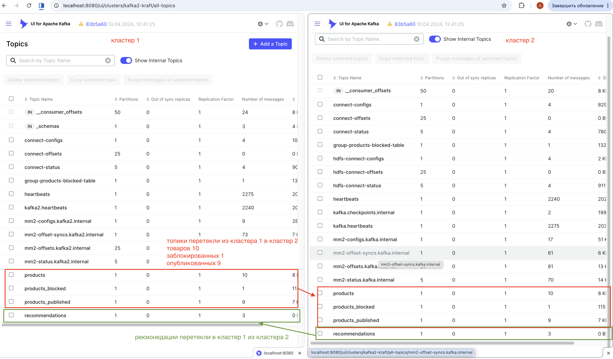
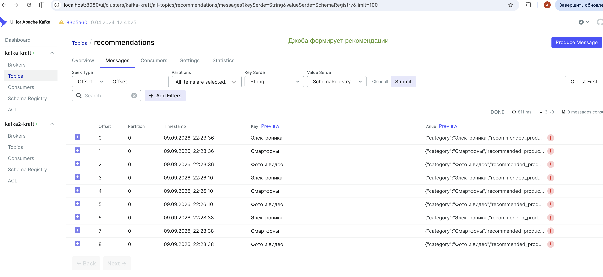
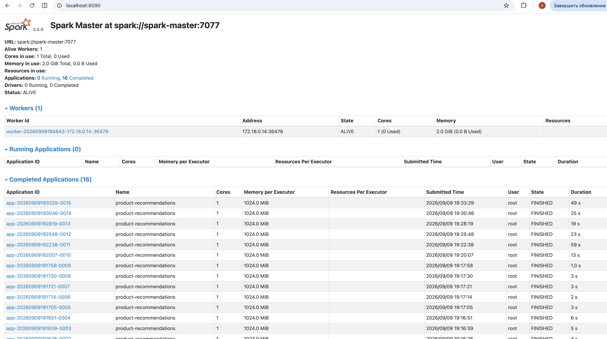

## Развернуть окружение

- Создайте файл  `./build/.env_make`
- В файле укажите переменные:
  - `CA_PASS` - для пароля сертификатов
  - `CRT_ALT_NAMES_IP_2` - ip адрес вашей машины, если чтобы можно было подключаться к Кафка с этого внешнего адреса.
    - Например, при запуске go-app:
      - `go run ./cmd/server-api/main.go`
    - Или не указывайте, будет использован 127.0.0.1
- Пример:
```bash
cat > "./build/.env_make" << EOF
CA_PASS=kafka123
CRT_ALT_NAMES_IP_2=127.0.0.1 #или ваш ip хостовой машины

EOF
```

```bash
make rebuild
```

> Развертывание всех сервисов может доходить до 10-15 минут!
> 
> Я не знаю какие настройки нужно подкрутить для ускорения. Есть скрипты проверки доступности сервисов. Они показывают процесс.
> В частности, это касается готовности Schema Registry, Kafka Connect, Kafka Connect HDFS.
> ServiceLoaderScanner отработал за 13 секунд вместо 16 минут — это победа. Но ReflectionScanner всё ещё медленный: hdfs3 сканировался 6.5 минут, filestream — 4.5 минуты. Общее время — около 12 минут, но в лимит 600 секунд уложилось.
> 
> Поэтому задание сделал на двух кластерах, в которых по одному контроллеру и одному брокеру.
> Иначе Докер ест почти ве ресурсы компа.

## docker-compose.yml
- `docker-compose.kafka1.yml` 
-   - 1-й и 2-й кластеры Kafka Kraft
- `docker-compose.apps1.yml` 
  - schema-registry 
  - kafka-connect - пишет данные в файл из топика "опубликованных товаров" кластера 1 (см ниже) 
  - mirror-maker - зеркалит топики во 2-й кластер, кроме топика рекомендаций; топик рекомендаций зеркалится из 2-го кластера в 1-й 
  - kafka-connect-hdfs - на 2-м кластере читает топик "опубликованных товаров", кладет в hdfs для формирования рекомендаций
  - kafka-ui - Web GUI для просмотра топиков и не только
  - hdfs-namenode + hdfs-datanode - hdfs-хранилище 
- `docker-compose.spark.yml` - Spark
  - spark-master + spark-worker + spark-job
    - выполняет задачу формирования рекомендаций
    - джоба раз в 2 минуты смотрит hdfs (`hdfs://hdfs-namenode:9000/topics/products_published/*/*`), обрабатывает файлы, формирует рекомендации по категориям товаров, и складывает в топик рекомендаций
- `docker-compose-app.yml` - go-app
  - это веб-сервис
  - `/shop/*` методы
    - публикует товары, 
    - добавляет/удаляет товары из заблокированных, 
    - публикует товары в опубликованные, если прошли "цензуру" (goka эмиттеры и процессоры)
  - `client/*` методы
    - поиск товара по имени
    - отправка запроса пользователя в топик Kafka
    - получение результатов поиска + рекомендации по той же категории найденного товара

## Пользователи Kafka

- `shop-api` - отправка товаров в кластер
- `client-api` - отправка запросов клиентов
- `admin` - администрирование кластера
- `kafka-c-1` - контроллеры 1-го кластера
- `kafka-b-1` - брокеры 1-го кластера
- `kafka2-c-1` - контроллеры 2-го кластера
- `kafka2-b-1` - брокеры 2-го кластера
- `schema-registry` - регистрация схем
- `kafka-ui` - для удобства проверки части результатов задания, можно смотреть в kafka-ui
- `mirror-maker` - дублирование данных на 2-й кластер
- `kafka-connect` - сохранение данных в файл, работа со spark, hdfs, аналитикой, коннекторами

## SuperUsers в кластерах

Честно, просто устал работать с ACL :)

Конечно, правильно, когда выдерживается подход с минимизацией прав для повышения уровня безопасности.

Список:
- кластер 1:
  - admin, kafka-b-1, kafka-b-2, kafka-b-3, kafka-c-1, kafka-c-2, kafka-c-3, mirror-maker, kafka-ui, schema-registry
- кластер 2:
  - admin, kafka2-b-1, kafka2-b-2, kafka2-b-3, kafka2-c-1,  kafka2-c-2, kafka2-c-3, mirror-maker, kafka-ui, schema-registry

## Топики

- `products` - для публикации товаров из файла
  - `go-app/data/shop-products.json` - файл с первыми 10-тью товарами
- `products_blocked` - список товаров, которые заблокированы, и не должны в итоге участвовать в обработке (аналитика и тп)
- `products_published` - список товаров, которые прошли фильтрацию заблокированных товаров, и должны в итоге участвовать в обработке (аналитика и тп)
- `recommendations` - рекомендации по товарам (результат аналитики)
- TODO топик поискового запроса пользователей

## Скрипты для развертывания

- `/scripts/certs.sh` - создание сертификатов, настройки зеркалирования, python джоба рекомендаций
  - для простоты, сертификаты на оба кластера и другие сервисы идентичные
  - `/mount_dir` - где будут созданы необходимые сертификаты
- `/scripts/topic.sh` - создание топиков
- `/scripts/acl.sh` - выдача прав
- `/scripts/schema-registry.sh` - регистрация JSON схемы в сервисе schema-registry
- `/scripts/kafka-connect.sh` - регистрация коннекторов
- `/scripts/wait_for_kafka.sh` - ожидание доступности кластера Kafka (ее брокеров и контроллеров), чтобы последующие операции в скриптах успешно выполнялись


## Настройки для зеркалирования данных между кластерами

```text
# ─── Исключения ───
topics.exclude = __.*|.*[\-\.]internal|.*[\-\.]._replica|_schemas|heartbeats|checkpoints|offset-syncs

# ─── Кластеры ───
clusters = kafka, kafka2

kafka.bootstrap.servers = ${BOOTSTRAP_SERVER}
kafka2.bootstrap.servers = ${BOOTSTRAP_SERVER2}

# ─── SSL для исходного кластера (kafka) ───
kafka.security.protocol = SSL
kafka.ssl.truststore.type = JKS
kafka.ssl.truststore.location = /etc/kafka/secrets/source/truststore.jks
kafka.ssl.truststore.password = ${CA_PASS}
kafka.ssl.keystore.type = PKCS12
kafka.ssl.keystore.location = /etc/kafka/secrets/source/keystore.pkcs12
kafka.ssl.keystore.password = ${CA_PASS}
kafka.ssl.key.password = ${CA_PASS}
kafka.ssl.endpoint.identification.algorithm = https

# ─── SSL для целевого кластера (kafka2) ───
kafka2.security.protocol = SSL
kafka2.ssl.truststore.type = JKS
kafka2.ssl.truststore.location = /etc/kafka/secrets/target/truststore.jks
kafka2.ssl.truststore.password = ${CA_PASS}
kafka2.ssl.keystore.type = PKCS12
kafka2.ssl.keystore.location = /etc/kafka/secrets/target/keystore.pkcs12
kafka2.ssl.keystore.password = ${CA_PASS}
kafka2.ssl.key.password = ${CA_PASS}
kafka2.ssl.endpoint.identification.algorithm = https

# ─── Репликация kafka → kafka2 (всё, кроме recommendations) ───
kafka->kafka2.enabled = true
kafka->kafka2.topics = ^(?!recommendations$).*
kafka->kafka2.groups = .*
kafka->kafka2.sync.group.offsets.enabled = true
kafka->kafka2.emit.checkpoints.enabled = true
kafka->kafka2.emit.heartbeats.enabled = true

# ─── Репликация kafka2 → kafka (только recommendations) ───
kafka2->kafka.enabled = true
kafka2->kafka.topics = recommendations
kafka2->kafka.groups = ^$
kafka2->kafka.sync.group.offsets.enabled = false
kafka2->kafka.emit.checkpoints.enabled = false
kafka2->kafka.emit.heartbeats.enabled = true

# ─── Фактор репликации внутренних топиков ───
replication.factor=1
checkpoints.topic.replication.factor = 1
heartbeats.topic.replication.factor = 1
offset-syncs.topic.replication.factor = 1
offset.storage.replication.factor = 1
config.storage.replication.factor = 1
status.storage.replication.factor = 1

# ─── Синхронизация метаданных ───
sync.topic.acls.enabled = true
sync.topic.configs.enabled = true
refresh.topics.enabled=true
refresh.groups.enabled = true
refresh.topics.interval.seconds = 60
refresh.groups.interval.seconds = 60

# ─── Политика именования реплицированных топиков ───
# По умолчанию топики получат префикс: kafka.my-topic → kafka2
# Если нужны одинаковые имена — раскомментируйте:
replication.policy.class = org.apache.kafka.connect.mirror.IdentityReplicationPolicy
```

Данные в файле можно увидеть так:
```bash
 docker exec -it kafka-connect cat /var/lib/kafka-connect-data/products_published.jsonl
```
пример:
```json lines
{"product_id":"p001","name":"Умные часы XYZ Pro","description":"Умные часы с функцией мониторинга здоровья, GPS и уведомлениями.","price":{"amount":4999.99,"currency":"RUB"},"category":"Электроника","brand":"XYZ","stock":{"available":150,"reserved":20},"sku":"XYZ-P001","tags":["умные часы","гаджеты","технологии"],"images":[{"url":"https://example.com/images/product1.jpg","alt":"Умные часы XYZ Pro - вид спереди"}],"specifications":{"weight":"50g","dimensions":"42mm x 36mm x 10mm","battery_life":"24 hours","water_resistance":"IP68"},"created_at":"2024-01-01T12:00:00Z","updated_at":"2024-01-10T15:30:00Z","index":"products","store_id":"store_001"}
```


## Поток данных

```
товары в файле → Goka (SHOP-API) → Kafka  → MM2  → kafka2 → HDFS → Spark → recommendations → (CLIENT‑API) → витрина/поиск
```

## Проверка

### Публикация и дублирование данных между кластерами

- [Topics clusters kafka2-kraft](http://localhost:8080/ui/clusters/kafka2-kraft/all-topics?perPage=25)
  - можно увидеть, что данные в топиках дублируются
  - Это состояние топиков 2-го кластера после публикации первых 10 товаров, когда еще нет заблокированных:
    - 

#### SHOP-API
TODO скрин браузера со списком заблокированных товаров
TODO скрин браузера для добавления/удаления товара из заблокированных

#### CLIENT-API
TODO скрин браузера с результатом поиска товара и рекомендации

### Проверить данные в HDFS

```bash
docker exec hdfs-namenode hdfs dfs -ls -R /topics
```
Результат вида:
```text
rwxr-xr-x   - appuser supergroup          0 2026-09-08 10:09 /topics/+tmp
drwxr-xr-x   - appuser supergroup          0 2026-09-08 10:09 /topics/+tmp/products_published
drwxr-xr-x   - appuser supergroup          0 2026-09-08 10:09 /topics/+tmp/products_published/partition=0
drwxr-xr-x   - appuser supergroup          0 2026-09-08 10:11 /topics/+tmp/products_published/partition=1
drwxr-xr-x   - appuser supergroup          0 2026-09-08 10:09 /topics/+tmp/products_published/partition=2
drwxr-xr-x   - appuser supergroup          0 2026-09-08 10:09 /topics/products_published
drwxr-xr-x   - appuser supergroup          0 2026-09-08 10:09 /topics/products_published/partition=0
-rw-r--r--   1 appuser supergroup       2304 2026-09-08 10:09 /topics/products_published/partition=0/products_published+0+0000000000+0000000002.json
-rw-r--r--   1 appuser supergroup       2186 2026-09-08 10:09 /topics/products_published/partition=0/products_published+0+0000000003+0000000005.json
-rw-r--r--   1 appuser supergroup       2170 2026-09-08 10:09 /topics/products_published/partition=0/products_published+0+0000000006+0000000008.json
drwxr-xr-x   - appuser supergroup          0 2026-09-08 10:11 /topics/products_published/partition=1
-rw-r--r--   1 appuser supergroup       2289 2026-09-08 10:09 /topics/products_published/partition=1/products_published+1+0000000000+0000000002.json
-rw-r--r--   1 appuser supergroup        735 2026-09-08 10:11 /topics/products_published/partition=1/products_published+1+0000000003+0000000003.json
drwxr-xr-x   - appuser supergroup          0 2026-09-08 10:09 /topics/products_published/partition=2
-rw-r--r--   1 appuser supergroup       2212 2026-09-08 10:09 /topics/products_published/partition=2/products_published+2+0000000000+0000000002.json
-rw-r--r--   1 appuser supergroup       2212 2026-09-08 10:09 /topics/products_published/partition=2/products_published+2+0000000003+0000000005.json
```

### Результат формирования рекомендаций

- [Топик рекомендаций после зеркалирования на 1-й кластер из 2-го](http://localhost:8080/ui/clusters/kafka-kraft/all-topics/recommendations/messages?keySerde=String&valueSerde=SchemaRegistry&limit=100)
  - 
- [URL: spark://spark-master:7077](http://localhost:8090/)
  - Отработки джобы:
  - 


### Мониторинг

TODO скрин с графаной с результатами мониторинга