# Версия решения

Ниже представлены две версии решения:
- Версия решения для локальной работы
- Версия решения для работы в облаке Yandex
  - Никак не удается подключиться к ВМ в облаке по ssh, как с ssh так и с yc командами.
  - Запрос в поддержку был отправлен, но пока тишина. А время идет. Думаю, что задача главная - это инструменты Кафка, а не разбор причин сетевых настроек.
  - Поэтому, просьба рассмотреть локальный вариант.
  - И в группе практикума наставник сказал, что с NiFi задачу можно сдать в локальном варианте.

# Версия решения для локальной работы

## Шаг 1 - развернуть окружение

Выполните команду:

```bash
make rebuild
```

В результате развернется:
- Будут созданы сертификаты для пользователей:
  - `kafka-c-i` - для контроллеров 1 -3
  - `kafka-b-i` - для брокеров 1 -3
  - `producer`
  - `consumer`
  - `kafka-ui`
  - `nifi`
  - `schema-registry`
  - см скрипт `/scripts/certs.sh`
- Развернуты сервисы:
  - Кластер Kafka 3 контроллера 3 брокера
  - Schema Registry
  - Kafka-UI
  - Apache NiFi
- Создан топик `metric` 
  - `/scripts/topic.sh`
- Выданы права для пользователей 
  - `/scripts/acl.sh`
- Зарегистрирована схема для будущих сообщений в Schema Registry
  - `/scripts/schema-registry.sh`
  - схема: `/schemas/metric.json`
- Развернуты сервис Go-App - приложение на Go
  - `go-app/.env` - настройки для приложения

Коммуникация данных сервисов происходит исключительно по SSL.

Docker-compose:
- `docker-compose.yml`
- `docker-compose-app.yml`

В терминале при развертывании увидим успех данного шага:

```bash
=== Creating topics started === 
Create topic: metric
Created topic metric.

Describe topic: metric
Topic: metric	TopicId: bhhuZ7S_RHudNKz-_wsSgQ	PartitionCount: 3	ReplicationFactor: 3	Configs: min.insync.replicas=3,cleanup.policy=compact,segment.bytes=536870912,retention.ms=604800000
	Topic: metric	Partition: 0	Leader: 5	Replicas: 5,6,4	Isr: 5,6,4	Elr: 	LastKnownElr: 
	Topic: metric	Partition: 1	Leader: 6	Replicas: 6,4,5	Isr: 6,4,5	Elr: 	LastKnownElr: 
	Topic: metric	Partition: 2	Leader: 4	Replicas: 4,5,6	Isr: 4,5,6	Elr: 	LastKnownElr: 

✅ Creating topics finished 
=== Waiting 10 seconds for Kafka to be ready === 
✅ Wait complete 
=== ACL started === 
Дадим schema-registry права на группу 'schema-registry' 
Adding ACLs for resource `ResourcePattern(resourceType=GROUP, name=schema-registry, patternType=LITERAL)`: 
 	(principal=User:CN=schema-registry,L=Moscow,OU=Practice,O=Yandex,C=RU, host=*, operation=ALL, permissionType=ALLOW)

Дадим schema-registry права на топик '_schemas'
Adding ACLs for resource `ResourcePattern(resourceType=TOPIC, name=_schemas, patternType=LITERAL)`: 
 	(principal=User:CN=schema-registry,L=Moscow,OU=Practice,O=Yandex,C=RU, host=*, operation=ALL, permissionType=ALLOW)

Дадим Kafka-UI права на Describe cluster
Adding ACLs for resource `ResourcePattern(resourceType=CLUSTER, name=kafka-cluster, patternType=LITERAL)`: 
 	(principal=User:CN=kafka-ui,L=Moscow,OU=Practice,O=Yandex,C=RU, host=*, operation=DESCRIBE, permissionType=ALLOW)

Дадим Kafka-UI права на Describe group
Adding ACLs for resource `ResourcePattern(resourceType=GROUP, name=*, patternType=LITERAL)`: 
 	(principal=User:CN=kafka-ui,L=Moscow,OU=Practice,O=Yandex,C=RU, host=*, operation=DESCRIBE, permissionType=ALLOW)
	(principal=User:CN=kafka-ui,L=Moscow,OU=Practice,O=Yandex,C=RU, host=*, operation=READ, permissionType=ALLOW)

Дадим Kafka-UI права Describe,Read на все топики
Adding ACLs for resource `ResourcePattern(resourceType=TOPIC, name=*, patternType=LITERAL)`: 
 	(principal=User:CN=kafka-ui,L=Moscow,OU=Practice,O=Yandex,C=RU, host=*, operation=DESCRIBE, permissionType=ALLOW)
	(principal=User:CN=kafka-ui,L=Moscow,OU=Practice,O=Yandex,C=RU, host=*, operation=READ, permissionType=ALLOW)

Топик 'metric': Доступен как для продюсеров, так и для консьюмеров.
Дадим producer права на запись в топик:
Adding ACLs for resource `ResourcePattern(resourceType=TOPIC, name=metric, patternType=LITERAL)`: 
 	(principal=User:CN=producer,L=Moscow,OU=Practice,O=Yandex,C=RU, host=*, operation=DESCRIBE, permissionType=ALLOW)
	(principal=User:CN=producer,L=Moscow,OU=Practice,O=Yandex,C=RU, host=*, operation=WRITE, permissionType=ALLOW)


Дадим consumer права на чтение из группы:
Adding ACLs for resource `ResourcePattern(resourceType=GROUP, name=*, patternType=LITERAL)`: 
 	(principal=User:CN=consumer,L=Moscow,OU=Practice,O=Yandex,C=RU, host=*, operation=DESCRIBE, permissionType=ALLOW)
	(principal=User:CN=consumer,L=Moscow,OU=Practice,O=Yandex,C=RU, host=*, operation=READ, permissionType=ALLOW)

Дадим consumer права на чтение из топика:
Adding ACLs for resource `ResourcePattern(resourceType=TOPIC, name=metric, patternType=LITERAL)`: 
 	(principal=User:CN=consumer,L=Moscow,OU=Practice,O=Yandex,C=RU, host=*, operation=DESCRIBE, permissionType=ALLOW)
	(principal=User:CN=consumer,L=Moscow,OU=Practice,O=Yandex,C=RU, host=*, operation=READ, permissionType=ALLOW)

Дадим nifi права на Describe group:
Adding ACLs for resource `ResourcePattern(resourceType=GROUP, name=nifi-consumer-group, patternType=LITERAL)`: 
 	(principal=User:CN=nifi,L=Moscow,OU=Practice,O=Yandex,C=RU, host=*, operation=DESCRIBE, permissionType=ALLOW)
	(principal=User:CN=nifi,L=Moscow,OU=Practice,O=Yandex,C=RU, host=*, operation=READ, permissionType=ALLOW)


Дадим nifi права Describe,Read на все топики
Adding ACLs for resource `ResourcePattern(resourceType=TOPIC, name=metric, patternType=LITERAL)`: 
 	(principal=User:CN=nifi,L=Moscow,OU=Practice,O=Yandex,C=RU, host=*, operation=DESCRIBE, permissionType=ALLOW)
	(principal=User:CN=nifi,L=Moscow,OU=Practice,O=Yandex,C=RU, host=*, operation=READ, permissionType=ALLOW)

✅ ACL finished 
=== Waiting 40 seconds for Kafka to be ready === 
✅ Wait complete 
=== Uploading Schema to SchemaRegistry start=== 
Регистрируем схемы 'metric-value'
{"id":1,"version":1,"guid":"eddc3552-27e7-705b-a3bf-cef9f24f6a6e","schemaType":"JSON","schema":"{\"$schema\":\"https://json-schema.org/draft/2020-12/schema\",\"type\":\"object\",\"title\":\"Metric\",\"description\":\"Metric data schema for Kafka messages\",\"properties\":{\"id\":{\"type\":\"integer\",\"description\":\"Metric unique identifier\",\"minimum\":0},\"type\":{\"type\":\"string\",\"enum\":[\"counter\"],\"description\":\"Type of metric\"},\"delta\":{\"type\":[\"integer\",\"null\"],\"description\":\"Delta value for counter\",\"default\":null}},\"required\":[\"id\",\"type\"]}"}

Проверка регистрации схемы 'metric-value'
["metric-value"]

Получить все версии схемы 'metric-value'
[1]
```

В логах go-app увидим:
```bash
INFO: 2026/08/24 17:45:58 InMainApp: in file: main.go:47: Producer has been connected to the brokers
INFO: 2026/08/24 17:45:58 Consumer: in file: main.go:78: Subscribed to a topic: metric

INFO: 2026/08/24 17:45:59 Producer: in file: main.go:106: Message has been sent to topic: metric :
Message{ID:1, MType:"counter", Delta:1}


INFO: 2026/08/24 17:45:59 Producer: in file: main.go:106: Message has been sent to topic: metric :
Message{ID:2, MType:"counter", Delta:2}


INFO: 2026/08/24 17:46:06 Consumer: in file: main.go:156: Processing batch:

[Message{ID:1, MType:"counter", Delta:1} Message{ID:2, MType:"counter", Delta:2}]
```

- продюсер успешно сериализовал и отправил два сообщения
- консьюмер успешно десериализовал и прочитал два сообщения

## Шаг 2 - настроить NiFi

- Откройте страницу https://localhost:8443/nifi/
  - По умолчанию он использует свои сертификаты. Поэтому в браузере надо будет "принять риски открытия сайта", после чего будет доступна форма авторизации.
- Найдем логин и пароль:
    ```bash
    docker logs nifi 2>&1 | grep -i "Generated Username" \
    && docker logs nifi 2>&1 | grep -i "Generated Password" 
    ```
Настроим процессоры:
  - Чтения сообщений из Kafka для топика `metric`
  - Вывод полученных сообщений в лог NiFi

### Настроим процессоры

Сообщения продюсером GoApp будут сериализоваться в формате JSON, согласно зарегистрированной схеме.

#### Processor ConsumeKafka - для чтения из Kafka

- Захватите иконку "Processor" и перенесите на "полотно"
- Откроется диалог, в котором найдем "ConsumeKafka"
- Выберите "ConsumeKafka" и нажмите добавить "Add"

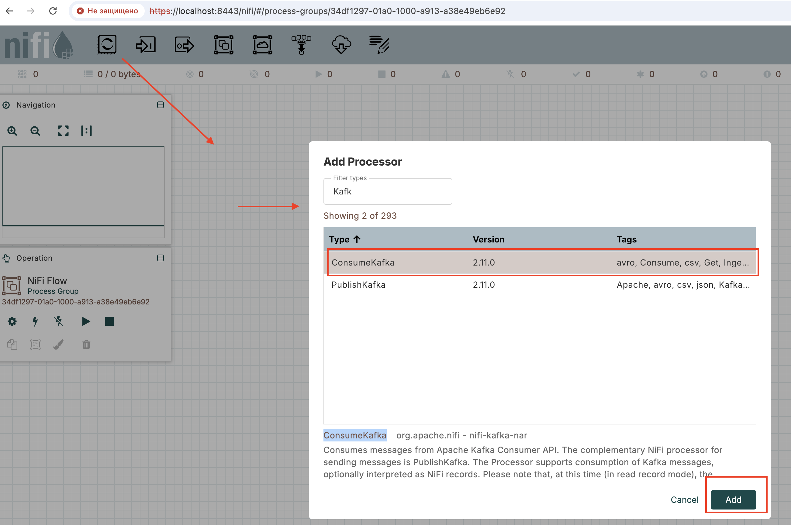

- Кликните правой кнопкой мыши по добавленному процессору "ConsumeKafka", чтобы настроить его

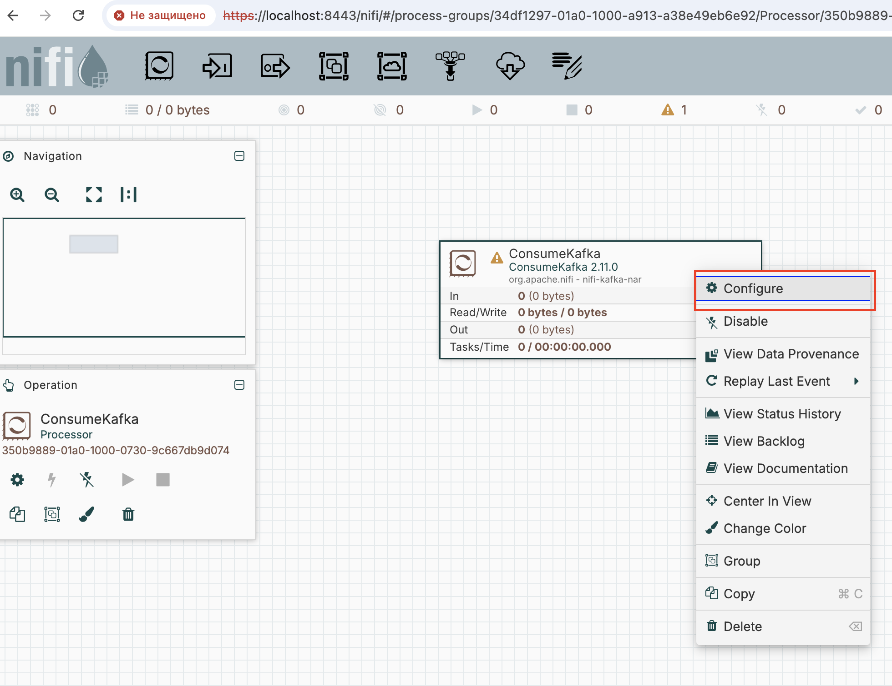

- Пропишем значения свойств:
  - Kafka Connection Service: создадим сервис для подключения к нашему Kafka кластеру
    - 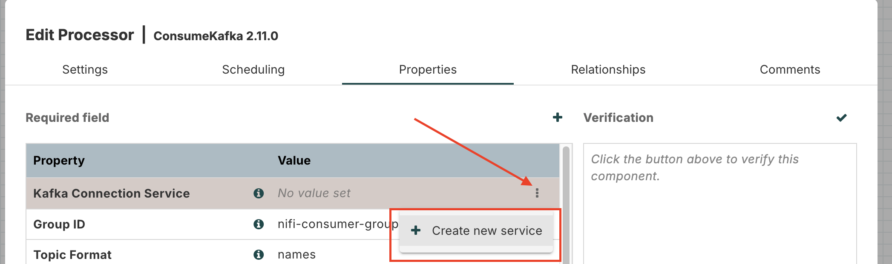
    - Выберем "Kafka3ConnectionService":
      - 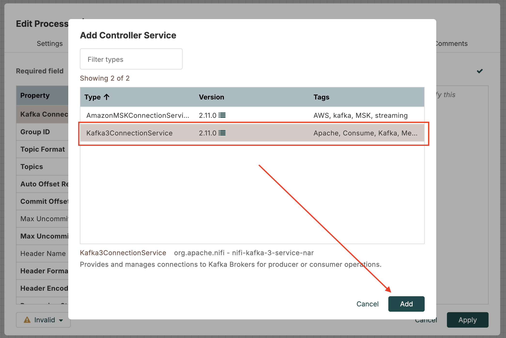
    - Настроим "Kafka3ConnectionService":
      - 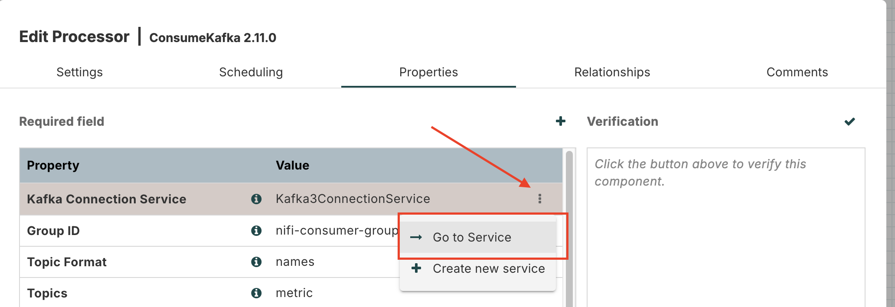
      - Если появится запрос на сохранение настроек, нажмите "да":
        - `Save changes before going to this Controller Service?`
      - Перейдем в режим редактирования настроек "Kafka3ConnectionService":
        - 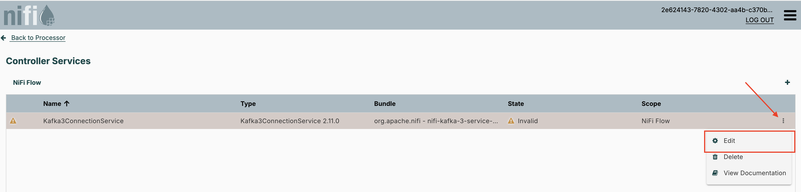
        - `Bootstrap Servers`: `kafka-b-1:9093,kafka-b-2:9093,kafka-b-3:9093`
        - `Security Protocol`: `SSL`
        - `SSL Context Service`: настроим и его - выбреем "Create new service"
          - Выберем "PEMEncodedSSLContextProvider":
          - 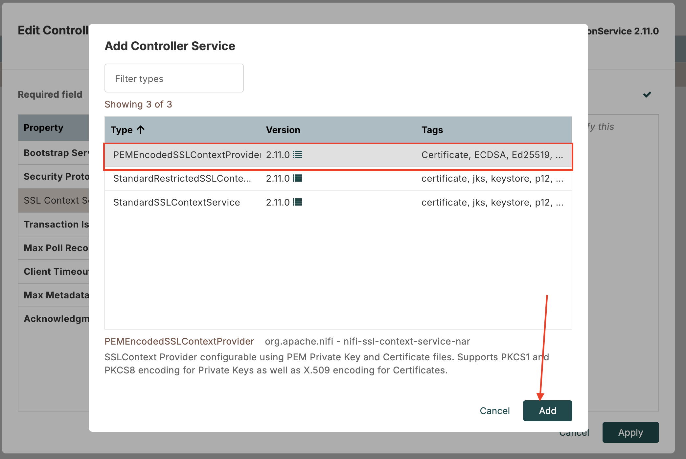
          - Настроим "PEMEncodedSSLContextProvider":
          - 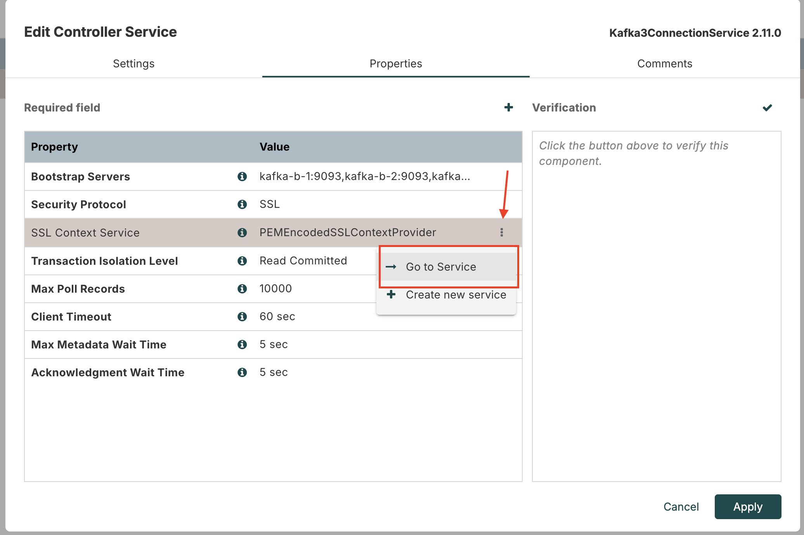
          - Сохраним предыдущие шаги:`Save changes before going to this Controller Service?` - `Yes`
          - Перейдем в настройки "PEMEncodedSSLContextProvider":
          - 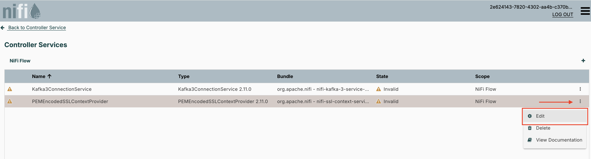
          - `Private Key`: скопируем и вставим содержимое `/mount_dir/nifi/creds/keystore.key`
          - `Certificate Chain`: скопируем и вставим содержимое `/mount_dir/nifi/creds/keystore.pem`
          - `Certificate Authorities`: скопируем и вставим содержимое `/mount_dir/nifi/creds/truststore.pem`
          - 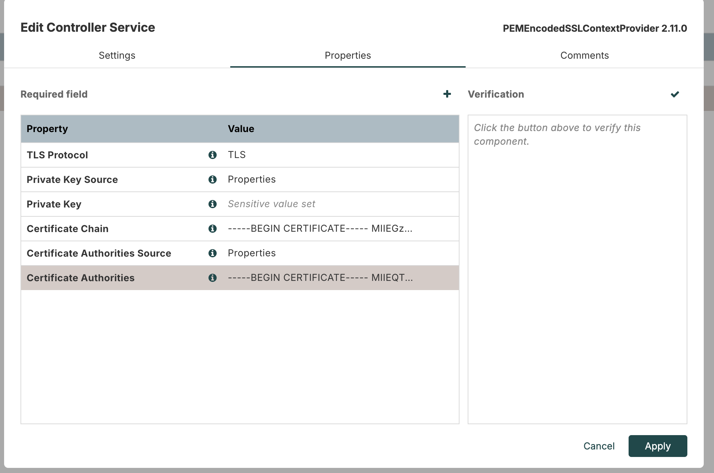
  - Group ID: `nifi-consumer-group`
    - как называет группа консьюмера "ConsumeKafka"
  - Topics: `metric`
    - чтобы консьюмер "ConsumeKafka" читал из этого топика
  - Остальные свойства оставим без изменений

Активируем:
 - PEMEncodedSSLContextProvider - выбрать "Enable"
 - Kafka3ConnectionService  - выбрать "Enable"

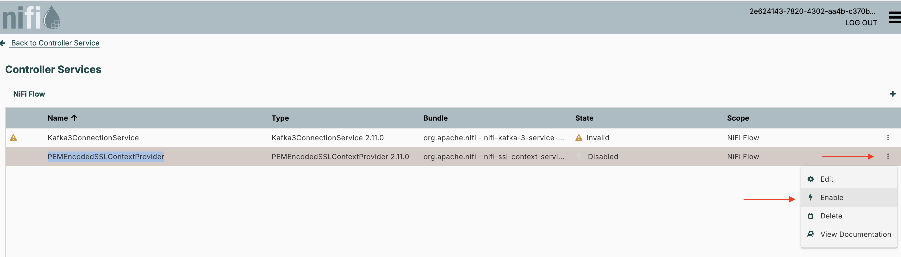

- Далее в диалогах нажать на кнопку "Enable".
- Дождаться состояния "Enabled":

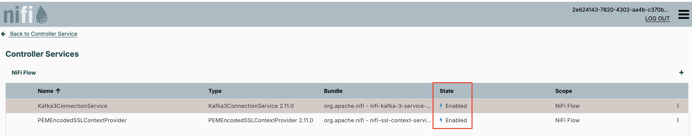

- Вернуться "Back to Controller Service"
- В диалоге с "Controller Service Details  Kafka3ConnectionService 2.11.0" - просто закрываем его "Close"
- Вернуться "Back to Processor"
- В диалоге "Edit Processor ConsumeKafka 2.11.0" - просто закрываем его "Cancel"

#### Processor LogAttribute - логирования сообщения в NiFi

- Добавим процессор LogAttribute
  - 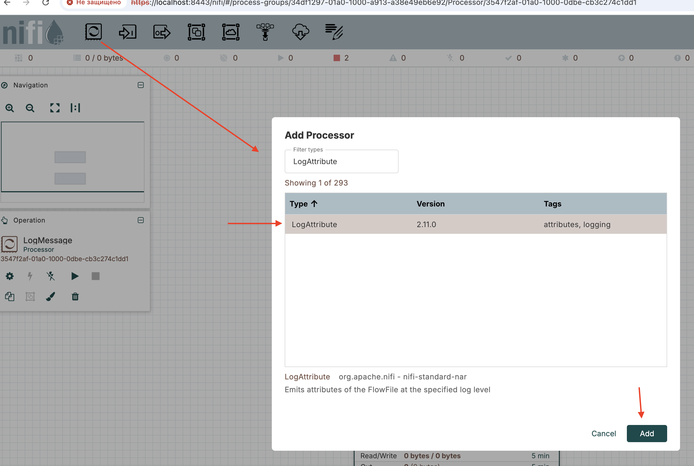
- Настроим его:
  - 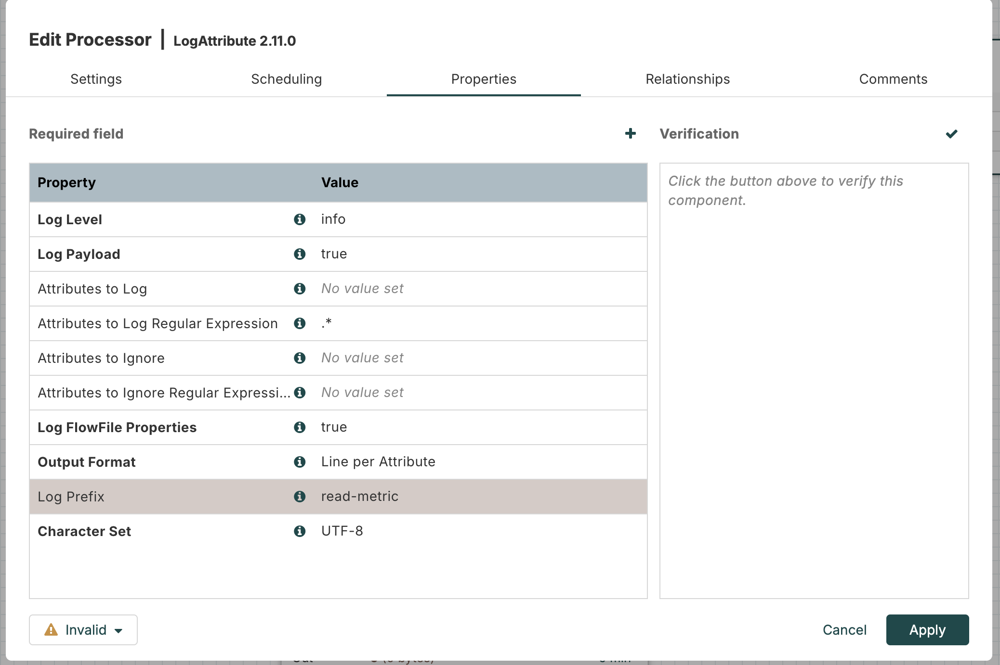
  - `Log Payload`: `true` - чтобы увидеть `json` тело наших сообщений.
  - `Log Prefix`: `read-metric` - чтобы удобнее было найти в логах информацию. Значение можно задать свое.
  - Во вкладке "Relationship" отметим чекбокс `terminate`, так как сообщения между процессорами дальше уходить не будут:
    - 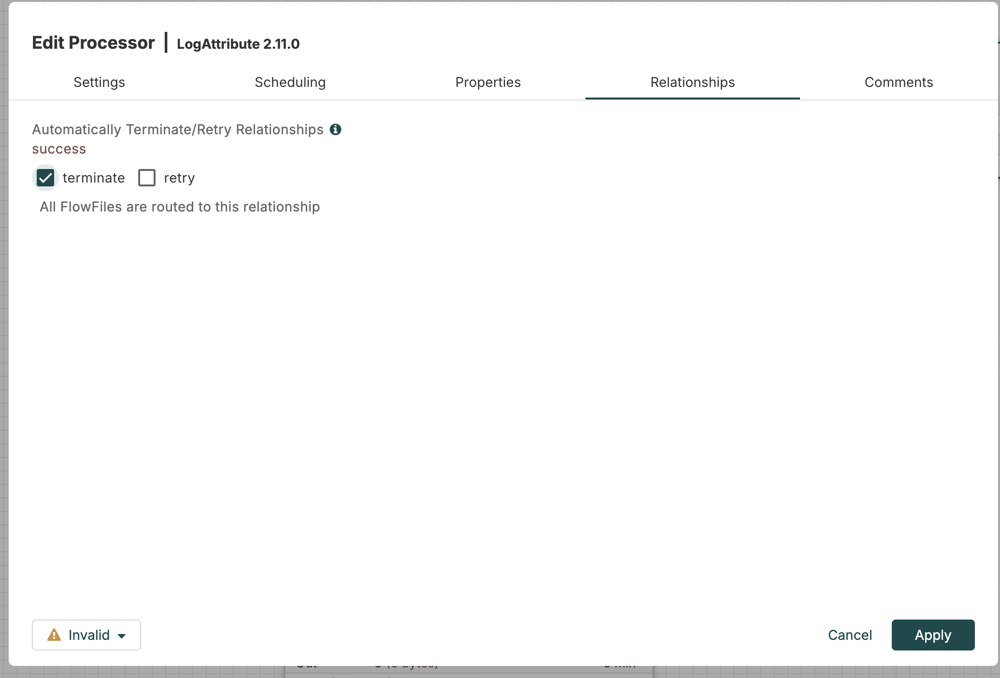


#### Соединим  Processor ConsumeKafka & LogAttribute

- При наведении на процессор ConsumeKafka появляется "черная стрелка" - ухватите за нее, и потяните к LogAttribute
- В открывшемся диалоге настроим соединение:
  - 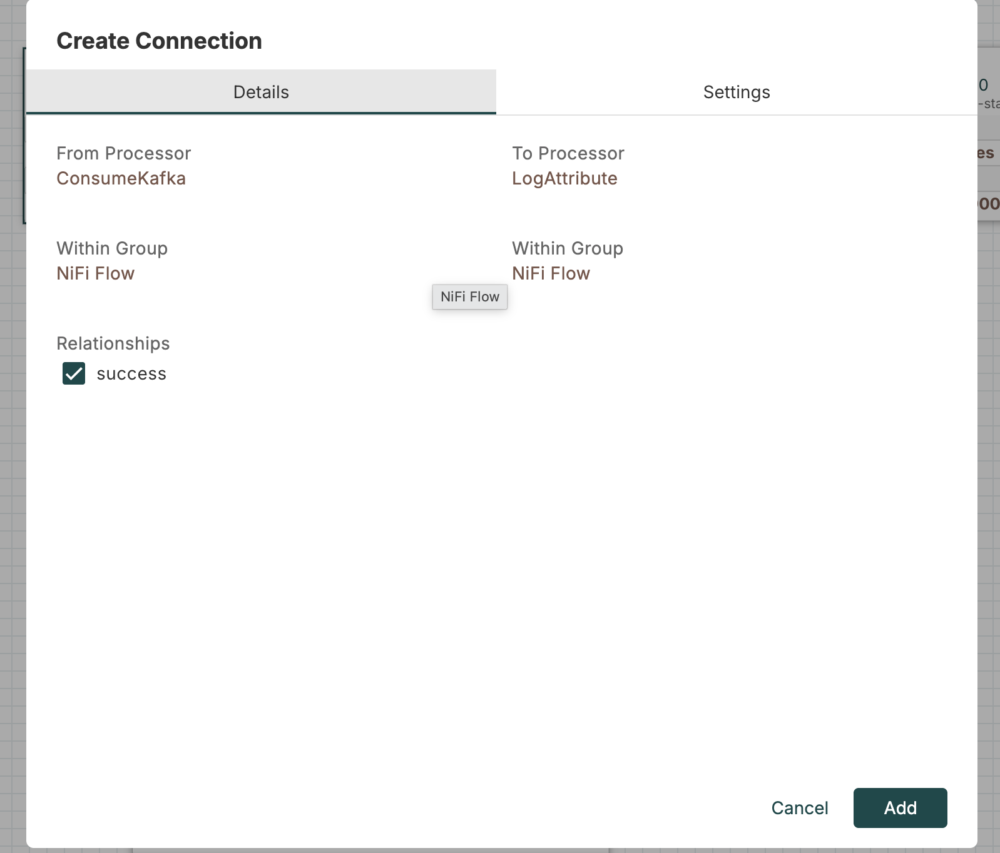

#### Запустим Processor ConsumeKafka & LogAttribute

- Выделите мышкой Processor ConsumeKafka & LogAttribute
- Слева нажмите "Start":
  - 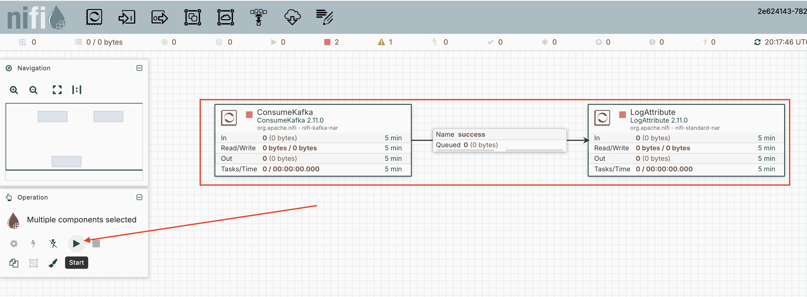

#### Просмотр результат

- перезапустите GoApp, чтобы он отправил сообщения снова
- в терминале выполните команду по поиску наших сообщений в логах NiFi:
  ```bash
  docker logs nifi 2>&1 | grep -i -A 100 "read-metric
  ```
- получим:
  - 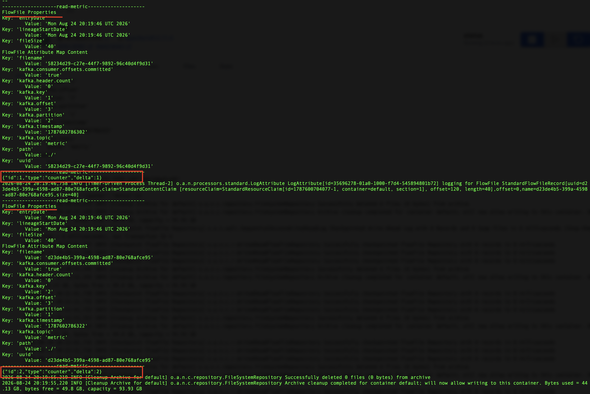
- сообщения успешно были прочитаны NiFi
- в web ui nifi так же увидим у процессоров, выходные/входные кол-во сообщений и байтов данных были переданы/получены:
  - 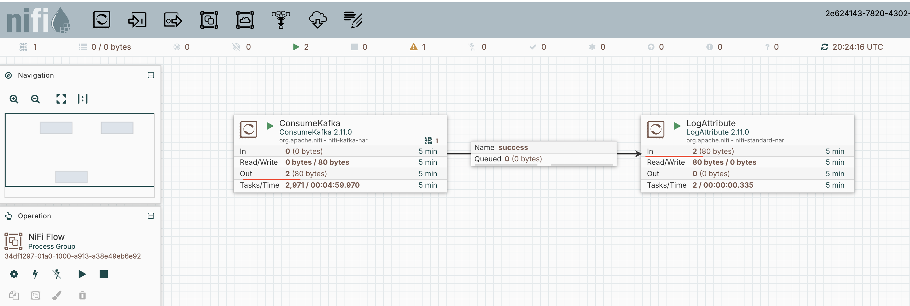

### Сохраним настроенные процессоры

Чтобы можно было добавить потом в процесс развертывания, или переиспользовать в других окружениях с NiFi.

В NiFi 2.110 рекомендуют настросить процессор для версионирования, например, чтобы работать с Git.

Сейчас этого делать не будем.
